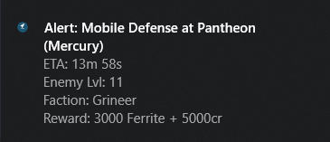

# wfnotify | wf10toast
 

A PyQt5 app | Windows Notifications project | For viewing Warframe API data. 

## wfnotify | Disclaimer
* This build of the app is currently under development and is not final.
* I did not create PyQt5. See [Acknowledgments](#acknowledgments)
* Source code for the entire program can be found in [wfnotify.py](wfnotify.py)

## Current Features
  1. Fetch current Cetustime (Check if night or day).
  2. Fetch current alerts data.
  3. Fetch current fissure data.
  4. Fetch current sortie data.

## Dependencies
wfnotify is written in Python 3.

wfnotify requires the following dependencies:
  1. * [PyQt5](https://riverbankcomputing.com/software/pyqt/download5) - A Python application framework.
  2. * [Requests](https://github.com/requests/requests/) - Python HTTP Requests for Humans ✨🍰✨

## Usage
Clone or download the master branch.

Extract and navigate to the project directory and run wfnotify by executing the main entry point file [wfnotify](wfnotify.py):
  ```
  python3 wfnotify.py
  ```

If you don't have python installed then you can run the .exe file which is a packaged version of the application
meaning you can still use the app without a python interpreter installed on you're system.

The .exe is located in:
  ```
  ./dist/wfnotify.exe
  ```

[Virustotal Scan](https://www.virustotal.com/#/file/9012e8806c3f9175b1566fe1fa41af38136d7c3a0b03a9efdf7a0edddf02321a/detection)
**The 5 detections are false positives. Examine the code used at [wfnotify.py](wfnotify.py)**

## wf10toast

Creates windows 10 notifications containing Warframe alerts data.

## Dependencies
wf10toast is written in Python 3.

wf10toast requires the following dependencies:
  1. * [win10toast](https://github.com/jithurjacob/Windows-10-Toast-Notifications) - An easy-to-use Python library for displaying Windows 10 Toast Notifications which is useful for Windows GUI development.
  2. * [Requests](https://github.com/requests/requests/) - Python HTTP Requests for Humans ✨🍰✨

## Usage
Clone or download the master branch.

Extract and navigate to the project directory and run wf10toast by executing the main entry point file [wf10toast](wf10toast.py):
  ```
  python wf10toast.py
  ```

**If you would like to have the program run periodically, you could create a windows scheduled task to run the script at certain intervals.**

## Authors -- Contributors

* **Daniel Brennand** - *Author of project* - [Dextroz](https://github.com/Dextroz)

## License

This project is licensed under the GPL-3.0 License - see the [LICENSE](LICENSE) for details.

## Acknowledgments
Riverbank Computing Limited created [PyQt5](https://riverbankcomputing.com/software/pyqt/download5)

Freeze (package) Python programs into stand-alone executables - [pyinstaller](http://www.pyinstaller.org)

[win10toast](https://github.com/jithurjacob/Windows-10-Toast-Notifications) - Creator and respective contributors.

[Requests](https://github.com/requests/requests/) - Creator and respective contributors.

Creators of the Warframe API endpoint. The Project would not be possible without this.

